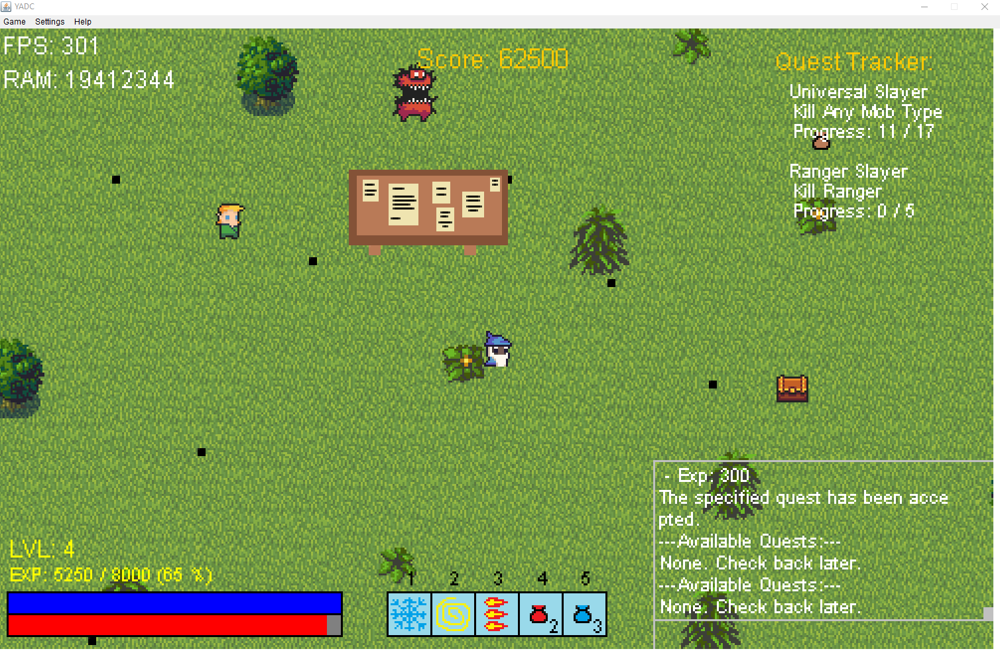

# YADC



To build:
```
gradle build
```

To play:
```
gradle play
```

To unit test:
```
gradle test
```

To run the performance test:
```
gradle perf_test
```


The game is currently configured to run properly on Windows.


#### Chat commands:
* SHOW/HIDE UI
* SHOW/HIDE DEBUG
* QUIT
* HELP
* BACKPACK
* GOLD
* QUEST (number)
* STATS / STATS (item_id)
* EQUIP (item_id)
* BUY HP/MANA/KEY

#### Default keybinds:
* Movement - WSAD
* Directional attack - Up/Down/Left/Right
* Toggle Slowing Spell - 1
* Toggle Stunning Spell - 2
* Toggle Multishot Spell - 3
* Use Health Potion - 4
* Use Mana Potion - 5
* Pause Game / Enter Chat - ESC/ENTER
* Scroll Chat Up/Down - PageUp/PageDown

Fun project which started as an uni course assignment.

Original authors:
* pawegrzy
* blatka
* kajanda